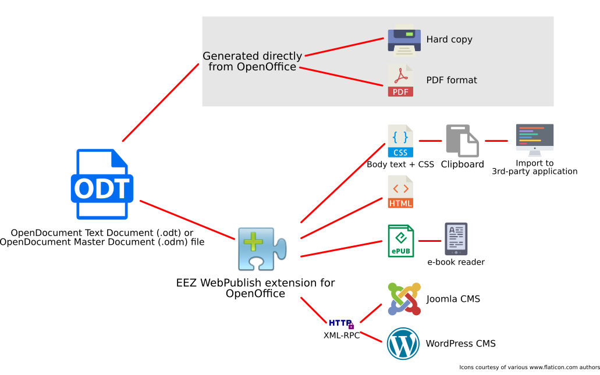

### Ownership and License

The contributors are listed in CONTRIB.TXT. This project uses the GPL v3 license, see LICENSE.TXT.
EEZ WebPublish uses the [C4.1 (Collective Code Construction Contract)](http://rfc.zeromq.org/spec:22) process for contributions.
To report an issue, use the [EEZ WebPublish](https://github.com/eez-open/WebPublish/issues) issue tracker.

## Introduction

The EEZ WebPublish extension for OpenOffice Writer and LibreOffice Writer enable conversion of _.odt_ file format to HTML and EPUB formats, copy of body text and CSS to clipboard and publishing to Joomla, WordPress CMS using Movable Type XML RPC.
Thanks to WebPublish it is possible to automate and speed up publishing procedure from single source (i.e. .odt file) to PDF, HTML, other document management applications (using clipboard), EPUB for e-book readers and Internet CMS (Joomla and WordPress).
 

 

The WebPublish require installed [OpenOffice](https://www.openoffice.org/download/) or [LibreOffice](https://www.libreoffice.org/download/download/) package and [Java Runtime Environment](http://www.oracle.com/technetwork/java/javase/overview/index.html) (JRE).

Reference document that include various .odt attributes can be found [here](https://github.com/eez-open/WebPublish/blob/master/doc/EEZ%20WebPublish%20test%20document.odt) and its HTML and EPUB outputs may vary between OpenOffice and LibreOffice WebPublish extension. The WebPublish for OpenOffice outputs can be found [here](https://github.com/eez-open/WebPublish/tree/master/OpenOffice/test%20outputs), and LibreOffice [here](https://github.com/eez-open/WebPublish/tree/master/LibreOffice/test%20outputs).

_All web pages on [EEZ web site](https://www.envox.hr/eez/) were generated with WebPublish for Joomla CMS._